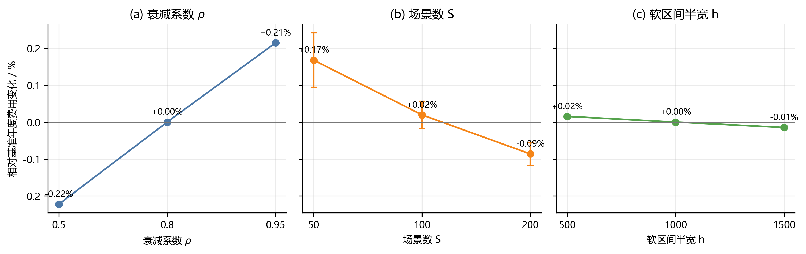

# 第八章 敏感性分析（两页精简写作稿）

本章将已有的方案对照和新增的参数扫描分开讨论。前者完全复用最终论文口径下的计算结果，后者仅针对问题四 4-3 的四时点滚动模型开展年度回测。除参数扫描外，问题二、问题三和问题四其他策略均未重新求解。

## 8.1 方案对比

表 9 汇总终端机制、滚动更新和价格信息结构的对照结果。问题二中，季节余弦终端基准叠加因果风险微调后，年度费用较固定 6000 kWh 终端基线降低 2,836.86 元（0.02%）。该变化较小，说明终端机制的主要作用是避免跨日储能透支，而非追求单日费用的显著下降。

问题三和问题四 4-3 中，全部四时点滚动相对仅 0:00 决策分别节省 351,055.72 元（2.36%）和 384,819.53 元（2.44%）。两种价格口径下的降幅接近，且已有边际结果表明 6:00 与 12:00 更新贡献绝大部分收益，故日内滚动的经济价值主要来自对负荷、光伏不确定性的及时修正。

问题四的价格完全信息下界仅将未来电价替换为实际值，负荷与光伏的信息结构、储能约束及滚动时点均保持不变；因此它衡量的是价格预测误差的经济影响，而不是所有预测变量均准确时的全局理论最优。4-2 与 4-3 相对该下界的差距分别为 0.93% 和 1.03%，表明现有周期预测和日内门控更新已捕获大部分可用于套利的价格信息。

**表 9  模型方案与价格信息对照**

| 对比对象 | 基准方案费用/元 | 对照方案费用或下界/元 | 费用变化/元 | 相对变化 |
| --- | ---: | ---: | ---: | ---: |
| 问题二：固定终端 → 季节余弦 + 风险微调 | 14,640,006.24 | 14,637,169.37 | -2,836.86 | -0.02% |
| 问题三：仅 0:00 → 全部四时点滚动 | 14,861,411.71 | 14,510,355.99 | -351,055.72 | -2.36% |
| 问题四 4-3：仅 0:00 → 全部四时点滚动 | 15,778,106.07 | 15,393,286.54 | -384,819.53 | -2.44% |
| 问题四 4-2：现实预测 → 价格完全信息下界 | 15,529,514.78 | 15,386,096.19 | -143,418.60 | -0.93% |
| 问题四 4-3：现实预测 → 价格完全信息下界 | 15,393,286.54 | 15,236,867.28 | -156,419.25 | -1.03% |

## 8.2 参数对比

以问题四 4-3 的正式模型为基准，取 \(\rho=0.80\)、场景数 \(S=100\)、终端软区间半宽 \(h=1000\) kWh；每次仅调整一个参数，并保持四时点滚动、预测/场景生成逻辑、储能边界和净结算规则不变。对场景数的三个水平分别使用 5 个共同随机种子，图中的误差棒为年度费用的标准差；其余两类参数使用固定正式种子。

在所考察的 \(\rho\) 取值中，\(\rho=0.50\) 的费用较基准低 0.22%，而 \(\rho=0.95\) 高 0.21%。这只能说明 \(\rho=0.50\) 在三个离散试验点中费用最低，不能证明其为连续区间的全局最优；三者差异均不超过 0.23%，因此正式模型对周期权重衰减系数总体稳健。场景数由 50 提高至 200 时，平均年度费用由基准上方 0.17% 变为下方 0.09%，但平均单日求解时间由 1.30 s 增至 1.97 s；考虑 \(S=100\) 与 \(S=200\) 的费用差异仅约 0.11%，保留 \(S=100\) 可在稳定性与计算效率间取得平衡。终端软区间半宽在 500--1500 kWh 内的费用变化不超过 0.02%，说明其主要影响跨日备用水平，不改变滚动策略的主结论。

*图 18  问题四 4-3 的年度费用参数灵敏度。纵轴为相对 \(\rho=0.80,S=100,h=1000\) 的年度费用变化；场景数 \(S\) 的误差棒为 5 个共同随机种子的标准差。*

**表 10  问题四 4-3 单参数扫描结果**

| 参数 | 试验值 | 年度费用相对基准变化 | 说明 |
| --- | ---: | ---: | --- |
| \(\rho\) | 0.50 / 0.80 / 0.95 | -0.22% / 0.00% / +0.21% | 三个点的差异均小于 0.23% |
| \(S\) | 50 / 100 / 200 | +0.17% / +0.02% / -0.09% | 5 个种子均值；标准差分别为 0.07%、0.04%、0.03% |
| \(h\) / kWh | 500 / 1000 / 1500 | +0.02% / 0.00% / -0.01% | 费用影响可忽略 |

综上，终端机制与参数微调均不会改变结论方向，而日内滚动在两类电价口径下均带来约 2.4% 的稳定费用节省。故本文的主要结论对终端设定、场景规模和周期权重的合理扰动具有稳健性。

## 论文删改指令

1. 删除原第 7.7 节“价格完全信息下界”的全部公式、文字和数值；在 7.6 节末尾替换为一句：**“价格信息价值的量化结果见第 8.1 节表 9。”**
2. 用本稿完整替换原第 8 章；正文只插入图 18，不插入紧急购电量敏感性图。
3. 表 9 与表 10 使用紧凑表格样式；图 18 宽度建议为 \(0.92\,\textwidth\)。以上文字、两张表和一张图可控制在约两页 A4 正文内。
